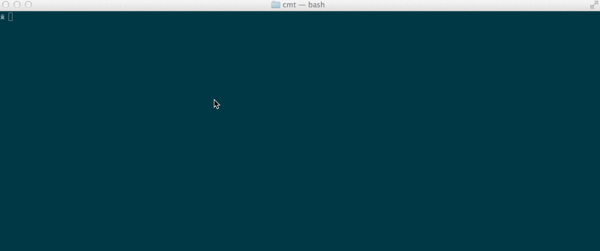

cmt
===

Get rid of all the boring git commit messages like 'small fix'. cmt is an automatic git commit generator



### Installation

```shell
$ npm install cmt -g
```

### Usage

Type ```shell $ cmt ``` in your terminal form a project using git to get a custom commit message
You can also use ```shell $ cmt [topic]``` to specify the topic of your messages


Available topics

- emojis
- sport
- sounds
- philosophy
- movies

### Contribute

If you want to contribute please enhance the list of the topics creating new ones and adding new entries on the existing ones

